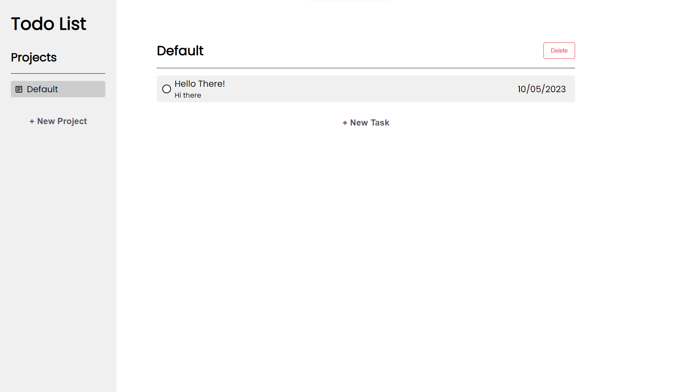

# Todo-List

# Overview

[Live Site](https://purpleboxe.github.io/Todo-List/)

## Preview

## The process

### Built with

- HTML5
- CSS
- JS
- Local Storage
- Webpack

### What I learned

This simple todo list taught me a lot.
I learned how to use local storage and learned how to better utilize webpack!

## Conclusion

This project took me a long time to make since I was learning new things along the way.
In the end I am quite happy with the result even though it is a super simple todo list!